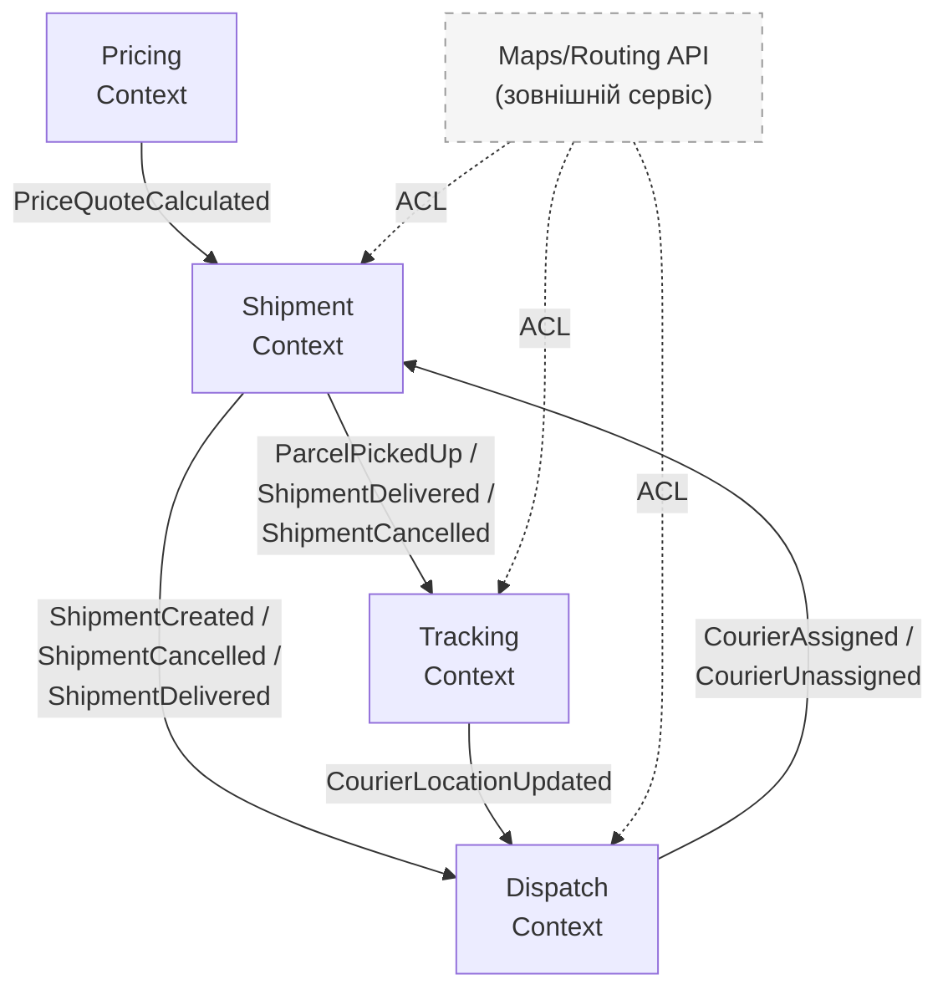

# ARCHITECTURE_PROPOSAL.md

### **Тема:** «Система керування кур'єрськими доставками та відстеженням посилок»
### **Команда:** Романюк Вікторія, Поліщук Юрій, Авраменко Вікторія
## Крок 1. Вибір бізнес-домену

**Логістика**

## Крок 2. Ключові бізнес-сценарії

### 1. Створення доставки та призначення кур'єра

1. Відправник авторизується в системі та обирає створення нової доставки.
2. Відправник вводить дані:
    - адресу забору посилки
    - адресу доставки
    - дані отримувача - ім'я та номер телефону
    - параметри посилки - вагу та габарити (довжина, ширина, висота)
3. Система перевіряє введені адреси та визначає відстань маршруту між точкою забору і точкою доставки.
4. На основі відстані та ваги посилки система розраховує вартість доставки.
5. Відправник бачить розраховану вартість і підтверджує оформлення доставки.
6. Система створює замовлення на доставку та фіксує погоджену вартість.
7. Система знаходить доступних кур'єрів, які можуть виконати доставку. Враховуються готовність кур'єра отримувати замовлення, зона його роботи, максимальна вага посилки та орієнтовний час прибуття до точки забору.
8. Система обирає найбільш підходящого кур'єра та надсилає йому пропозицію доставки. Одночасно кур'єр може мати не більше однієї активної пропозиції.
9. Кур'єр може прийняти або відхилити пропозицію. Якщо кур'єр відхиляє її або не відповідає протягом визначеного часу, система продовжує пошук іншого кур'єра.
10. Після прийняття пропозиції кур'єр призначається на доставку, а відправник отримує інформацію про призначеного кур'єра.

Якщо на момент оформлення немає відповідного доступного кур'єра, доставка залишається створеною та очікує призначення кур'єра.

Якщо після призначення, але до отримання посилки, кур'єр не може виконати доставку, він може відмовитися від неї. У такому випадку система припиняє його призначення та шукає нового кур'єра. Після отримання посилки відмова кур'єра більше недоступна.

### 2. Виконання та відстеження доставки

1. Після того як кур'єр прийняв пропозицію та був призначений на доставку, він отримує повну інформацію про адресу забору, адресу доставки, відправника (ініціали + номер), отримувача (ініціали + номер) та параметри посилки.
2. Кур'єр підтверджує початок руху до точки забору. Система фіксує, що кур'єр прямує до відправника.
3. Кур'єр прибуває до точки забору, отримує посилку від відправника та підтверджує це в системі.
4. Після підтвердження отримання посилки система фіксує початок її транспортування до отримувача.
5. Під час виконання доставки система регулярно оновлює поточне місцезнаходження кур'єра та орієнтовний час прибуття.
6. Відправник може переглядати поточний статус доставки, місцезнаходження кур'єра та орієнтовний час прибуття.
7. Кур'єр прибуває до адреси доставки, передає посилку отримувачу та підтверджує завершення доставки.
8. Система фіксує факт і час успішної доставки.

### 3. Скасування доставки (сценарій для клієнта)

1. Відправник відкриває активну доставку та обирає її скасування.
2. Система перевіряє поточний етап виконання доставки та визначає, чи дозволене скасування.
3. Якщо кур'єр ще не був призначений, система скасовує доставку без додаткових дій.
4. Якщо кур'єр уже призначений або прямує до точки забору, доставка скасовується, кур'єр отримує повідомлення про скасування, а його призначення на цю доставку припиняється.
5. Якщо кур'єр уже забрав посилку, то скасування доставки недоступне.
6. Відправник отримує підтвердження про успішне скасування доставки.

## Крок 3. Виділення Bounded Contexts

Для розбиття системи на Bounded Contexts спочатку було виділено commands та domain events, що стосуються кожного сценарію.

### Сценарій 1

**Commands:**
- CalculatePriceQuote
- CreateShipment
- FindCourier
- SendCourierProposal
- AcceptCourierProposal
- RejectCourierProposal
- DeclineAssignment

**Domain events:**
- PriceQuoteCalculated
- ShipmentCreated
- CourierFound
- CourierProposalSent
- CourierProposalAccepted
- CourierProposalRejected
- CourierProposalExpired
- CourierAssigned
- CourierAssignmentDeclined
- CourierUnassigned

### Сценарій 2

**Commands:**
- StartTripToPickup
- ConfirmParcelPickup
- CompleteDelivery
- UpdateCourierLocation

**Domain events:**
- CourierDepartedForPickup
- ParcelPickedUp
- CourierLocationUpdated
- ShipmentDelivered

### Сценарій 3

**Commands:**
- CancelShipment
- ReleaseCourier

**Domain events:**
- ShipmentCancelled
- CourierReleased

### Bounded Contexts

#### 1. Shipment Context

Shipment відповідає за створення доставки та керування її життєвим циклом.

Тут були виокремлені commands і events типу:

```
CreateShipment > ShipmentCreated
StartTripToPickup > CourierDepartedForPickup  (ініціатор - кур'єр, але змінюється стан Shipment)
ConfirmParcelPickup > ParcelPickedUp
CompleteDelivery > ShipmentDelivered
CancelShipment > ShipmentCancelled
```

Ці команди та події зосереджені навколо стану й життєвого циклу доставки. Shipment не повинен знати, як розраховується тариф, як обирається кур'єр або де цей кур'єр зараз знаходиться.

#### 2. Pricing Context

Pricing відповідає за розрахунок вартості доставки.

Тут були виокремлені commands і events типу:

```
CalculatePriceQuote > PriceQuoteCalculated
```

Pricing виділений окремо, оскільки правила розрахунку вартості можуть змінюватися незалежно від правил створення, скасування або виконання доставки.

#### 3. Dispatch Context

Dispatch відповідає за пошук і підбір відповідного кур'єра, надсилання йому пропозиції доставки та створення призначення після прийняття цієї пропозиції.

Тут були виокремлені commands і events типу:

```
SetCourierAvailability > CourierAvailabilityChanged
FindCourier > CourierFound
SendCourierProposal > CourierProposalSent
AcceptCourierProposal > CourierProposalAccepted, CourierAssigned
RejectCourierProposal > CourierProposalRejected
ReleaseCourier > CourierReleased
DeclineAssignment > CourierAssignmentDeclined, CourierUnassigned
                    CourierProposalExpired
```

Dispatch виділений в окремий bounded context, оскільки логіка вибору й призначення кур'єра є самостійною частиною бізнес-логіки. Shipment може знати, який courier призначений, але не повинен знати, як саме система його обрала серед інших кандидатів.

#### 4. Tracking Context

Tracking відповідає за отримання та збереження актуального місцезнаходження кур'єрів, а також за відстеження їхнього руху під час виконання доставки.

Тут були виокремлені commands і events типу:

```
UpdateCourierLocation > CourierLocationUpdated
```

Tracking виділений окремо, оскільки координати кур'єра можуть оновлюватися значно частіше, ніж стан Shipment.

## Крок 4. Ізоляція даних

### Shipment Context

**Модель даних:**

- Shipment - shipmentId, senderId, pickupAddress, deliveryAddress, status, **assignedCourierId**, **agreedPrice**, createdAt, pickedUpAt, deliveredAt, cancelledAt
- Address - addressLine, latitude, longitude
- Recipient - recipientName, recipientPhone
- Parcel - parcelWeight, parcelDimensions

**Domain Snapshot:**

**agreedPrice** отримується з Pricing і зберігається під час створення доставки, коли користувач підтверджує розраховану вартість. Так ми фіксуємо погоджену ціну, навіть якщо тарифи пізніше зміняться.

**assignedCourierId** отримується з Dispatch після події CourierAssigned і зберігається в Shipment як snapshot призначеного кур'єра.

### Pricing Context

**Модель даних:**

- Tariff - tariffId, basePrice, pricePerKm, pricePerKg
- PriceQuote - quoteId, distance, weight, calculatedPrice, calculatedAt

**Domain Snapshot:** окремих snapshots немає.

### Dispatch Context

**Модель даних:**

- Courier - courierId, isAvailable, serviceZone, maxParcelWeight, **lastKnownLatitude, lastKnownLongitude, locationUpdatedAt**
- DispatchRequest - shipmentId, **pickupCoordinates, deliveryCoordinates, parcelWeight**, createdAt, status
- CourierAssignment - assignmentId, shipmentId, courierId, status, assignedAt, releasedAt
- CourierProposal - proposalId, shipmentId, courierId, status, createdAt, expiresAt

**Domain Snapshot:**

**pickupCoordinates, deliveryCoordinates, parcelWeight** отримуються із Shipment після створення доставки та зберігаються в DispatchRequest. Це дозволяє Dispatch повторно виконувати пошук кур'єра та формувати для нього пропозицію без повторного отримання основних даних доставки із Shipment.

**lastKnownLatitude, lastKnownLongitude, locationUpdatedAt** надходять із Tracking через CourierLocationUpdated і зберігаються в Dispatch як snapshot останнього відомого місцезнаходження кур'єра. Це дозволяє Dispatch оцінювати ETA до точки забору без синхронного запиту до Tracking під час кожного пошуку кур'єра.

### Tracking Context

**Модель даних:**

- TrackingSession - trackingId, shipmentId, courierId, **pickupCoordinates, deliveryCoordinates,** estimatedArrivalTime, startedAt, finishedAt
- CourierLocation - courierId, latitude, longitude, recordedAt

**Domain Snapshot:**

**pickupCoordinates, deliveryCoordinates** отримуються після призначення кур'єра та зберігаються, щоб багаторазово перераховувати ETA під час руху кур'єра. До забору посилки ETA розраховується до точки забору, а після забору до точки доставки.

## Крок 5. Матриця зв'язків (Context Map)

### 1. Pricing > Shipment

- **Supplier (Upstream)** - Pricing
- **Customer (Downstream)** - Shipment

Shipment використовує Pricing для розрахунку вартості доставки. Після розрахунку Pricing формує PriceQuoteCalculated, результат якого Shipment використовує під час створення доставки та фіксації погодженої ціни.

### 2. Shipment > Dispatch

- **Supplier (Upstream)** - Shipment
- **Customer (Downstream)** - Dispatch

Dispatch реагує на події життєвого циклу Shipment:

- ShipmentCreated - Dispatch починає пошук кур'єра.
- ShipmentCancelled - Dispatch припиняє пошук або робить активну пропозицію неактуальною.
- ShipmentDelivered - Dispatch завершує активне призначення кур'єра.

### 3. Dispatch > Shipment

- **Supplier (Upstream)** - Dispatch
- **Customer (Downstream)** - Shipment

Shipment реагує на результати роботи Dispatch:

- CourierAssigned - Shipment фіксує призначеного кур'єра.
- CourierUnassigned - Shipment прибирає призначення та повертається до очікування нового кур'єра.

### 4. Shipment > Tracking

- **Supplier (Upstream)** - Shipment
- **Customer (Downstream)** - Tracking

Tracking реагує на зміни життєвого циклу доставки:

- Shipment після отримання CourierAssigned фіксує кур'єра і ініціює створення TrackingSession / передає Tracking необхідні дані доставки.
- ParcelPickedUp - Tracking починає відстежувати рух до точки доставки.
- ShipmentDelivered - відстеження завершується.
- ShipmentCancelled - відстеження також завершується.

### 5. Tracking > Dispatch

- **Supplier (Upstream)** - Tracking
- **Customer (Downstream)** - Dispatch

Dispatch реагує на CourierLocationUpdated. Tracking передає актуальне місцезнаходження кур'єрів, а Dispatch використовує його під час вибору найбільш підходящого кур'єра та оцінки часу прибуття до точки забору.

### 6. Maps/Routing API > Shipment, Dispatch, Tracking

- **Supplier (Upstream)** - Maps/Routing API
- **Customers (Downstream)** - Shipment, Dispatch, Tracking

Maps/Routing API виступає Supplier, оскільки надає зовнішні географічні дані та розрахунки маршруту.

- Shipment використовує його для роботи з адресами та визначення відстані маршруту.
- Dispatch - для оцінки відстані та ETA кур'єра до точки забору.
- Tracking - для побудови маршруту та розрахунку ETA під час доставки.

ACL використовується між Maps/Routing API та контекстами Shipment, Dispatch і Tracking. Він потрібен, щоб перетворювати формат даних зовнішнього API у внутрішній формат системи:

- Shipment - адреси, координати й відстань
- Dispatch - відстань і ETA кур'єра до точки забору
- Tracking - маршрут і ETA під час руху

### Схема взаємодії між Bounded Contexts 

